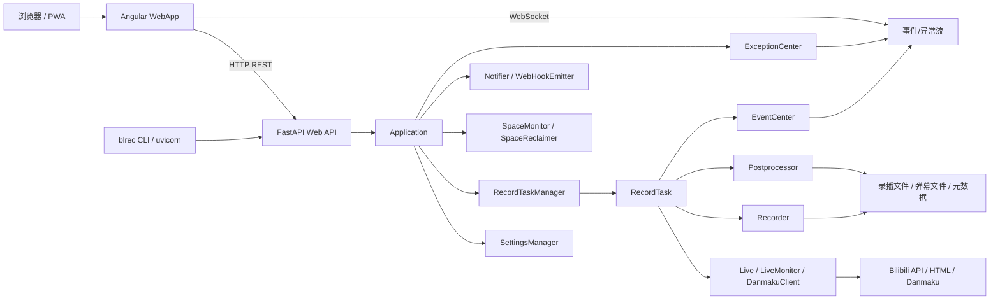
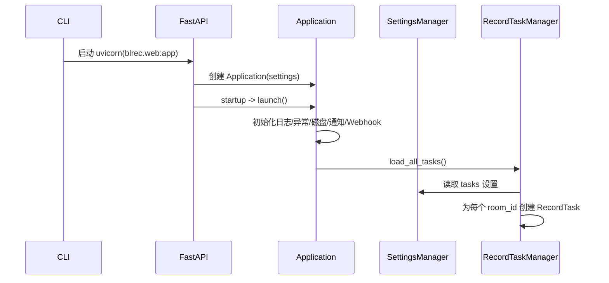
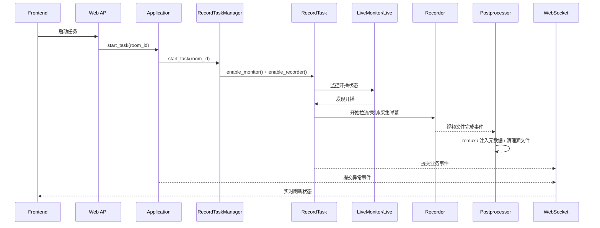

# blrec 项目整体架构

本文档基于当前仓库代码整理，目标是帮助维护者快速理解项目的运行形态、模块边界、核心数据流和构建交付方式。

搭建本地环境和执行检查时，请配合阅读[开发指南](development.md)。准备版本和发行物时，请阅读[维护与发布](maintenance.md)。

## 1. 项目概览

`blrec` 是一个“前后端分离、运行时一体化”的 B 站直播录制系统：

- 后端使用 Python 实现，负责任务管理、直播状态监控、流录制、弹幕采集、后处理、通知、Webhook、磁盘空间治理和 Web API。
- 前端使用 Angular 实现，负责任务管理界面、设置界面、状态展示和异常/事件提示。
- 前端构建产物会被打进 Python 包，由 FastAPI 统一对外提供页面、REST API 和 WebSocket。

从部署视角看，用户通常只启动一个 `blrec` 进程；从源码视角看，仓库包含两个主要子系统：

- Python 后端源码：`src/blrec`
- Angular 前端源码：`webapp`

## 2. 总体拓扑

## 3. 目录分层

### 3.1 顶层目录

| 路径 | 作用 |
| --- | --- |
| `src/blrec` | Python 主体源码 |
| `webapp` | Angular 前端源码 |
| `src/blrec/data/webapp` | Angular 构建后的静态资源，运行时由 FastAPI 挂载 |
| `docs` | 安装、开发、架构和维护文档 |
| `README.md` | 项目状态与文档入口 |
| `CONTRIBUTING.md` | Issue、Discussion 和 Pull Request 协作规范 |
| `pyproject.toml` / `setup.py` / `MANIFEST.in` | Python 打包配置 |
| `blrec.spec` | PyInstaller 构建配置 |
| `Dockerfile` | PyInstaller 构建和容器运行入口 |

### 3.2 后端主要包

| 包 | 作用 |
| --- | --- |
| `blrec.cli` | 命令行入口，负责参数解析并启动 ASGI 服务 |
| `blrec.web` | FastAPI 应用、路由、中间件、依赖和安全控制 |
| `blrec.application` | 进程级应用对象，统一装配任务、设置、通知、异常和资源管理 |
| `blrec.setting` | 全局设置、任务设置、持久化和“任务设置覆盖全局设置”逻辑 |
| `blrec.task` | 任务编排层，一个房间对应一个 `RecordTask` |
| `blrec.bili` | B 站 API / 页面 / 弹幕接入能力 |
| `blrec.core` | 录制核心，包括直播流录制、弹幕落盘、封面下载、统计信息 |
| `blrec.postprocess` | 录制完成后的 remux、元数据注入、源文件清理 |
| `blrec.disk_space` | 磁盘空间监控和自动回收 |
| `blrec.notification` | 邮件和多种推送渠道通知 |
| `blrec.webhook` | 事件 Webhook 发射 |
| `blrec.event` | 事件总线 |
| `blrec.exception` | 异常总线和异常处理 |
| `blrec.flv` / `blrec.hls` / `blrec.danmaku` | 媒体、HLS、弹幕相关底层处理 |
| `blrec.update` | 更新信息查询 |
| `blrec.utils` | 通用工具和 Rx/异步辅助 |

### 3.3 前端主要目录

| 路径 | 作用 |
| --- | --- |
| `webapp/src/app/core` | API、WebSocket、鉴权、路由滚动、异常处理等基础服务 |
| `webapp/src/app/tasks` | 任务列表、详情、工具栏、信息面板、任务设置 |
| `webapp/src/app/settings` | 全局设置页，各子设置面板分别对应后端设置模型 |
| `webapp/src/app/about` | 关于页和应用信息展示 |
| `webapp/src/app/shared` | 共享组件、指令、Pipe、样式和工具函数 |

## 4. 启动与入口

### 4.1 Python 入口链路

启动路径如下：

1. `src/blrec/__main__.py`
2. `src/blrec/cli/main.py`
3. `uvicorn.run('blrec.web:app', ...)`
4. `src/blrec/web/__init__.py` 导出 `main.py` 中的 FastAPI `api` 为 ASGI `app`

CLI 主要职责：

- 解析命令行参数
- 将运行参数写入环境变量，如配置文件、输出目录、日志目录、API Key
- 启动 Uvicorn
- 控制进度显示和 SSL/host/port/root_path

### 4.2 Web 应用启动

`src/blrec/web/main.py` 在模块加载时完成这些事情：

- 读取环境变量并定位设置文件
- 加载 `Settings`
- 初始化进程级 `Application`
- 创建 FastAPI `api`
- 注册异常处理器
- 注册 REST 路由与 WebSocket 路由
- 将打包后的前端静态资源挂载到 `/`

FastAPI 生命周期事件负责驱动应用对象：

- `startup` 时执行 `app.launch()`
- `shutdown` 时先持久化设置，再执行 `app.exit()`

## 5. 后端架构

### 5.1 Application：进程级装配层

`src/blrec/application.py` 中的 `Application` 是后端总调度入口，职责包括：

- 持有 `SettingsManager`
- 持有 `RecordTaskManager`
- 初始化和销毁异常处理、磁盘空间管理、通知器、Webhook
- 对 Web 层暴露统一的任务和设置操作方法
- 提供应用级状态与信息

可以把它理解成“服务容器 + 用例门面”，Web 路由基本不直接碰底层对象，而是经由 `Application` 完成。

### 5.2 设置层：全局配置与任务级覆盖

`src/blrec/setting` 负责：

- 定义完整设置模型
- 加载和持久化 `settings.toml`
- 维护全局设置
- 维护每个房间对应的 `TaskSettings`
- 把全局设置和任务局部设置合成为最终生效配置

核心点在 `SettingsManager`：

- 全局设置变化后，会调用对应的 `apply_*_settings`
- 任务设置变化后，会调用对应的 `apply_task_*_settings`
- 任务配置不是完整复制全局配置，而是通过 shadow/override 机制覆盖对应字段

这让系统既支持“统一默认配置”，又支持“单任务特化配置”。

### 5.3 任务编排层：一个房间一个 RecordTask

`src/blrec/task/task_manager.py` 中的 `RecordTaskManager` 负责：

- 从设置文件加载全部任务
- 新增/删除任务
- 启停任务、启停监控、启停录制
- 把设置应用到指定任务
- 对外汇总任务状态、参数、元数据、文件详情

内部结构是：

- `room_id -> RecordTask` 的内存映射
- 所有外部操作最终都落在单个 `RecordTask`

`RecordTask` 是房间级业务聚合对象，组合了：

- `Live`
- `LiveMonitor`
- `DanmakuClient`
- `Recorder`
- `Postprocessor`

它负责把“直播间信息”“监控开播”“录制媒体流”“保存弹幕”“后处理文件”串成一个完整任务。

### 5.4 B 站接入层

`src/blrec/bili` 封装了对 B 站直播能力的访问：

- `Live`：房间信息、用户信息、直播状态、播放地址、时间戳等
- `LiveMonitor`：监控直播状态变化
- `DanmakuClient`：连接弹幕服务
- `api.py` / `net.py` / `wbi.py`：HTTP API 访问和签名辅助

`Live` 的设计比较关键：

- 优先走 API 获取数据
- API 不可用时回退到 HTML 页面解析
- 使用 `aiohttp.ClientSession` 维护会话
- 支持自定义 `User-Agent` 和 `Cookie`

这层的目标是尽量把“B站接口不稳定、易风控、返回结构多变”的复杂度隔离出去。

### 5.5 录制核心层

`src/blrec/core` 是录制引擎主体。

`Recorder` 负责聚合多个录制相关组件：

- `StreamRecorder`：拉流、切片/分段、统计吞吐、写视频文件
- `DanmakuReceiver` + `DanmakuDumper`：接收并保存结构化弹幕
- `RawDanmakuReceiver` + `RawDanmakuDumper`：保存原始弹幕数据
- `CoverDownloader`：保存封面图

核心特点：

- 录制和弹幕写入是并行协作关系
- 可按文件大小或时长分割
- 支持多种流格式与质量选择
- 在流中断、参数变化等情况下维持录制稳定性

`core/operators` 下的模块体现了录制流程中的一系列操作符式处理，例如：

- 拉取流地址
- 统计流量和进度
- 处理连接异常
- 监控录制状态

### 5.6 后处理层

`src/blrec/postprocess/postprocessor.py` 监听录制完成事件，对产出文件做进一步处理：

- FLV 注入额外元数据
- 使用 `ffmpeg` remux 为 MP4
- 根据策略删除源文件
- 维护后处理进度和状态

后处理采用队列串行消费：

- 录制完成后，视频文件进入队列
- 后处理工作协程逐个消费
- 完成后再发出事件给外部系统和前端

这保证了录制和后处理解耦，避免把文件处理阻塞在主录制链路上。

### 5.7 事件、异常与通知

项目有两条横向通道：

#### 事件通道

- `blrec.event.EventCenter` 基于 `reactivex.Subject`
- 各类事件提交到统一事件中心
- WebSocket `/ws/v1/events` 将事件推送给前端
- Webhook 和通知器也可以消费同类业务事件

#### 异常通道

- `blrec.exception.ExceptionCenter` 同样基于 `reactivex.Subject`
- 未处理异常会被统一提交
- WebSocket `/ws/v1/exceptions` 把异常文本推送给前端
- `ExceptionHandler` 负责应用级异常处理与上报

这种设计把“业务执行”和“对外告警/展示”解耦了。

### 5.8 磁盘空间治理

`blrec.disk_space` 中主要有两个长期运行组件：

- `SpaceMonitor`：检测输出目录磁盘空间
- `SpaceReclaimer`：空间不足时回收旧文件

它们在 `Application.launch()` 阶段启用，在 `Application.exit()` 阶段关闭，属于典型的后台守护型服务。

### 5.9 Web 层：统一对外接口

`src/blrec/web` 是后端的接入边界。

REST 路由大致分为：

- `routers/tasks.py`：任务管理、状态、文件、元数据
- `routers/settings.py`：全局设置和任务设置
- `routers/application.py`：应用状态、重启、退出
- `routers/validation.py`：参数校验
- `routers/update.py`：更新查询

WebSocket 路由：

- `/ws/v1/events`
- `/ws/v1/exceptions`

静态资源托管：

- `resource_filename(__name__, '../data/webapp')` 定位打包后的 Angular 产物
- `StaticFiles` 挂载到 `/`
- 因此前端页面、API 和 WebSocket 都由同一进程提供

## 6. 前端架构

### 6.1 路由与模块切分

`webapp/src/app/app-routing.module.ts` 使用懒加载拆分三个主要业务模块：

- `/tasks`
- `/settings`
- `/about`

默认路由跳转到 `/tasks`，这说明“任务监控和录制控制”是产品主视图。

### 6.2 Core 模块

`webapp/src/app/core` 负责前端运行时基础设施：

- `app.service.ts`：应用信息/状态、重启、退出
- `event.service.ts`：连接 `/ws/v1/events`
- `exception.service.ts`：连接异常 WebSocket
- `update.service.ts`：更新检查
- `auth.service.ts`：API Key 认证状态
- `url.service.ts`：统一拼接 API 和 WebSocket 地址
- `storage.service.ts`：本地存储
- `http-interceptors/auth.interceptor.ts`：请求鉴权

前端因此没有把 URL、鉴权和实时连接散落到业务组件里，而是集中在 core 层统一处理。

### 6.3 Tasks 模块

`webapp/src/app/tasks` 是前端主业务区，围绕“任务”展开：

- `task-list` / `task-item`：任务列表和卡片展示
- `task-detail`：任务详情
- `info-panel`：任务统计和图表
- `toolbar`：批量操作和筛选
- `add-task-dialog`：新增任务
- `task-settings-dialog`：任务级配置
- `status-display`：运行状态展示

其服务层主要通过 `TaskService` 和 `TaskManagerService` 调用 REST API，并将成功/失败结果映射为 UI 消息提示。

### 6.4 Settings 模块

`webapp/src/app/settings` 按设置域拆分多个子面板，和后端设置模型基本一一对应：

- `bili-api-settings`
- `header-settings`
- `output-settings`
- `recorder-settings`
- `post-processing-settings`
- `disk-space-settings`
- `notification-settings`
- `webhook-settings`
- `danmaku-settings`
- `logging-settings`

这说明前端设置页并不是一个松散表单，而是后端配置模型的 UI 映射层。

### 6.5 Shared 模块

`webapp/src/app/shared` 提供跨模块复用能力：

- 公共组件
- 公共指令
- 格式化 Pipe
- 样式片段
- 类型与工具函数

它承担的是“界面复用层”，而不是业务编排层。

## 7. 前后端交互方式

系统同时使用三类交互：

### 7.1 页面与静态资源

- 浏览器访问 `/`
- FastAPI 返回 `src/blrec/data/webapp` 中的静态文件
- Angular 接管前端路由

### 7.2 REST API

用于请求-响应式操作，例如：

- 获取任务列表
- 修改设置
- 启停任务
- 查询文件详情
- 获取应用状态

### 7.3 WebSocket

用于实时消息流：

- 业务事件流
- 异常流

这使前端既能主动查询，也能被动接收录制过程中的实时变化。

## 8. 核心运行时流程

### 8.1 启动流程

### 8.2 录制流程

## 9. 构建与交付方式

这是本项目很重要的一点：源码分离，交付合并。无论采用源码、独立二进制还是容器运行，用户最终访问的都是同一个后端进程及其内嵌 Web 前端。

### 9.1 前端构建

`webapp/angular.json` 中配置：

- `outputPath: ../src/blrec/data/webapp`

也就是说，执行 `cd webapp && npm run build` 后：

- Angular 产物不会输出到 `webapp/dist`
- 而是直接写入 Python 包目录 `src/blrec/data/webapp`

### 9.2 Python 源码打包

`MANIFEST.in` 中：

- `graft src/blrec/data`

因此构建 Python 源码包或 wheel 时，前端静态文件会一起进入安装包。源码安装只作为开发和验证路径，不是社区维护版面向普通用户的发行渠道。

### 9.3 PyInstaller 打包

根目录的 `blrec.spec` 以 `src/blrec/__main__.py` 为入口，收集 blrec 的数据文件和 Uvicorn 等运行时动态模块。

PyInstaller 产物包含 Python 应用及已构建的前端资源。计划中的 GitHub Release 会分别提供 Windows x64、Linux amd64 和 Linux arm64 压缩包；首个维护版本发布前，这些产物仍属于目标发行形态。

### 9.4 容器镜像

`Dockerfile` 使用多阶段构建：builder 阶段安装项目并生成 PyInstaller 单文件程序，运行阶段只复制程序并安装 ffmpeg、证书和必要的系统动态库。

容器默认使用 `/cfg`、`/log` 和 `/rec` 保存设置、日志和录播文件，并通过 `2233` 端口提供 Web 界面和 API。正式镜像源与标签约定见[安装与使用](installation.md)。

### 9.5 运行时托管

`src/blrec/web/main.py` 中将 `src/blrec/data/webapp` 挂载为静态站点根目录，所以最终交付形态是：

- 一个 Python 应用或由 PyInstaller 封装的等价可执行程序
- 内含已经编译好的 Web 前端
- 对外暴露单一端口

## 10. 维护建议

### 10.1 阅读顺序建议

第一次读仓库时，先阅读[开发指南](development.md)准备环境，再按这个顺序进入源码：

1. `src/blrec/cli/main.py`
2. `src/blrec/web/main.py`
3. `src/blrec/application.py`
4. `src/blrec/task/task_manager.py`
5. `src/blrec/task/task.py`
6. `src/blrec/core/recorder.py`
7. `src/blrec/postprocess/postprocessor.py`
8. `webapp/src/app/app-routing.module.ts`
9. `webapp/src/app/core`
10. `webapp/src/app/tasks`

### 10.2 修改时的边界意识

- 改接口前，先确认前端 `core/services` 与 `tasks/settings` 是否同步依赖该字段。
- 改设置模型前，先确认 `SettingsManager.apply_*` 和前端设置页是否同时需要更新。
- 改录制链路前，优先确认事件提交、后处理和文件状态展示是否会被影响。
- 不要手改 `src/blrec/data/webapp` 下的编译产物，应修改 `webapp` 源码后重新构建。
- 改发行方式前，确认 README、安装指南、维护指南、Release 资产和镜像标签使用相同口径。

## 11. 架构总结

`blrec` 的核心结构可以概括为：

- 一个 FastAPI 承载的单进程应用
- 一个以 `Application -> RecordTaskManager -> RecordTask` 为主线的后端编排模型
- 一个以 `Live / Recorder / Postprocessor` 为核心的录制流水线
- 一个以 Angular 模块化页面 + REST/WebSocket 为交互面的前端
- 一套把前端构建产物内嵌进 Python 包，并可继续封装为独立二进制或容器的交付方式

它的设计重点不是“层数很多”，而是把长期运行录制系统真正需要的能力拆清楚了：任务编排、稳定录制、后处理、实时反馈、配置覆盖、异常上报和空间治理。
